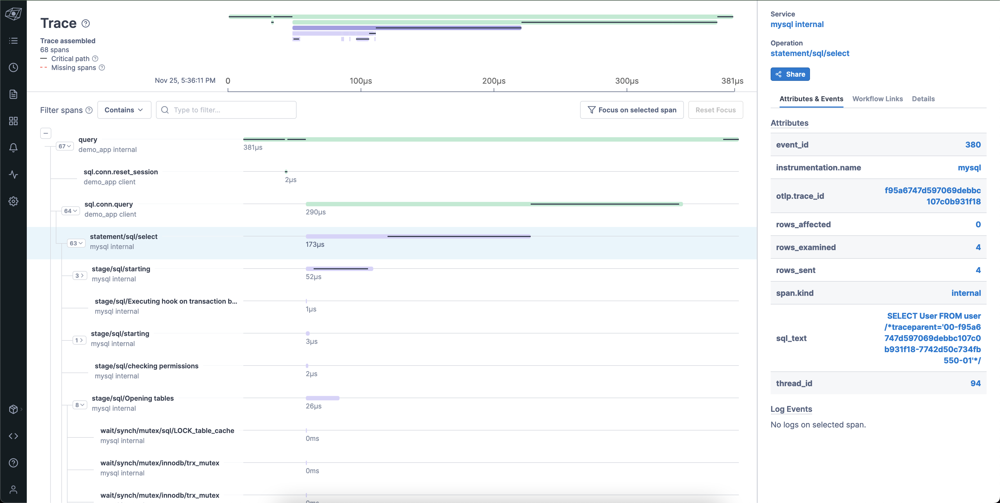

# mysql_span_exporter

uses the event tables from the mysql `performance_schema` (primarily the one for [statements](https://dev.mysql.com/doc/mysql-perfschema-excerpt/5.7/en/performance-schema-statement-tables.html)) to create spans corresponding to important SQL events

appends a `traceparent` comment to issued queries to propagate context from client code to the SQL server
NB this is sort of assuming this is what otel will settle on for a trace propagation method to sql servers (https://github.com/open-telemetry/opentelemetry-specification/issues/2279)

very basic example

TODOs:

- why dont we get a wait event for queries that have to wait for a table lock??
- teach the exporter to add more attributes and stuff
  - can we link wait spans to the span holding the lock???
- teach the exporter to check if perf monitoring is on; optionally turn it on (how does the mysql metrics exporter deal with this?)
- containerize, helmify, etc
